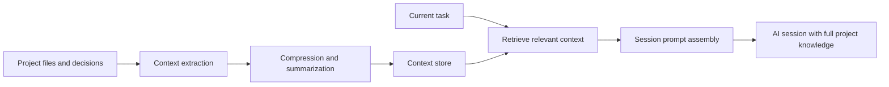

# Developer AI Context System

Last updated: 2026-06-02

A reusable system for compressing project knowledge so AI coding assistants already understand [Project Name] at the start of every session. Reduces token usage, eliminates repeated context-setting, and keeps developer AI workflows fast and consistent.

## The Problem This Solves

Every new AI coding session starts blank. Without a context system:

- you re-explain the tech stack, architecture, and patterns every time
- tokens are spent on setup instead of actual work
- the assistant makes suggestions that do not match the project conventions
- decisions and rationale from previous sessions are lost
- prompt quality degrades as the project grows

This system treats project knowledge as a managed asset that is pre-loaded, compressed, and version-controlled so every session starts informed.

## What This System Does

This is not a user-facing chatbot. It is a backend developer workflow tool that:

- stores compressed project knowledge in structured context files
- retrieves only the relevant context for the current task
- injects that context efficiently at the start of each AI session
- keeps token usage low by loading only what each task needs
- builds up project knowledge over time without manual repetition each session

Think of it as a project memory layer that lives alongside the codebase and is maintained as the project evolves.

## How It Works

The developer context system applies RAG principles to the developer's own workflow instead of an end-user product.



The context store replaces the expensive habit of explaining the project from scratch every session.

## Why RAG For Developer Workflow

RAG is commonly associated with user-facing document chat. But the same retrieval and compression pattern solves a different problem for developers: **session context is expensive and repetitive**.

Without retrieval, an AI assistant may:

- forget conventions established two sessions ago
- suggest patterns that contradict project decisions
- ask clarifying questions you have already answered many times
- use generic defaults instead of project-specific approaches
- burn large portions of the token budget on re-orientation

RAG applied to developer workflow gives [Organization Name] one controlled source of project knowledge that is retrieved on demand rather than repeated manually every session.

## Benefits For The Developer

### Lean token usage

Only the context relevant to the current task is loaded. A targeted task uses a fraction of what a full project explanation costs.

### Consistent AI behavior across sessions

Because the AI reads from the same structured context files, its suggestions stay aligned with project conventions even across separate sessions and team members.

### Built-in project memory

Architecture decisions, pattern choices, and active work state are written once and retrieved automatically. You stop losing context when sessions end.

### Faster task startup

Prompt templates and pre-loaded context eliminate the setup phase. Sessions start on the actual work immediately.

### Easier onboarding

A new developer or a new session on an unfamiliar part of the project can load context and become productive without a lengthy briefing.

## Context Pipeline

The pipeline has five stages. Each stage is scoped to the developer's workflow, not a product feature.

### 1. Context extraction

Pull project knowledge from the sources that define the project:

- architecture decision records
- README and documentation
- codebase conventions and patterns
- active work notes
- past AI session outputs worth keeping

The goal is to produce a set of structured context files that compress what the AI needs to know.

### 2. Chunking and compression

Split and compress context so it loads efficiently. Each context file should be small enough to load as part of a session prompt without consuming most of the token budget.

Good compression:

- keeps only what the AI cannot infer from the codebase itself
- strips verbose history in favour of current state
- preserves decisions and rationale over implementation details
- is specific enough that the AI does not need to ask clarifying questions

### 3. Embeddings and indexing

For projects with large documentation or deep history, embed the context files so individual sections can be retrieved by task description rather than always loading everything.

This is what allows targeted loading: a task about authentication retrieves only auth-related context, not the entire project summary.

### 4. Retrieval

The retriever selects the most relevant context for the current task.

Good retrieval for developer workflow uses:

- task description as the query
- project namespace to scope results
- metadata filters for context file type
- optional reranking to surface the most directly applicable chunks

### Per-project retrieval setup requirement

Retrieval does not work automatically when a new project is added. Each project must be onboarded so the system knows where that project's context files live and how to scope queries to that project only.

For every new project, set up:

- one project identifier such as `project_id`
- one retrieval namespace, collection, or index partition
- source paths pointing to the `.ai/` context directory
- metadata filters so one project does not retrieve another project's context
- an initial indexing job
- a refresh path triggered when context files change

### Minimum onboarding rule

Before a project is considered context-ready, confirm:

- does the project have a `claude-instructions.md` at the root?
- does the project have a `copilot-instructions.md` at the root?
- are the `.ai/` context files created and populated?
- is the context indexed?
- does every chunk carry the project identifier?
- is query-time retrieval scoped to that project?
- is there a path to update context when the project changes?

### 5. Session assembly

The retrieved context chunks are assembled into the session initialization prompt. The AI reads this at session start and operates within that project frame for the duration of the session.

### 6. Evaluation

Check that context is working by testing session quality:

- does the AI know the current tech stack without being told?
- does it follow project conventions without being reminded?
- does it avoid suggestions that contradict documented decisions?
- does it stay on the correct task scope?

If any of these fail, the context files need updating.

### 7. Context freshness

Context files become stale as the project evolves. Define a refresh rule for each file type:

- `active-context.md` — update every session or after every meaningful change
- `architecture-decisions.md` — update when a major technical decision changes
- `patterns.md` — update when conventions change
- `project-summary.md` — update when the scope, stack, or phase changes

## Context File Types

A developer context system maintains several files, each with a distinct scope and update cadence.

### project-summary.md

A single compressed overview. The AI reads this first on every session.

Contains:
- what [Project Name] does and who it is for
- current tech stack
- deployment model
- primary data sources and integrations
- current development phase

Target length: 200 to 400 tokens.

### architecture-decisions.md

A record of key technical choices and the reasoning behind them.

Contains:
- major framework and library selections with rationale
- patterns the codebase uses and does not use
- tradeoffs that were consciously accepted
- decisions that should not be revisited without a discussion

Target length: 400 to 800 tokens.

### active-context.md

The current working state. Updated frequently — treat it as a living session note.

Contains:
- what is currently being built
- what is known to be broken or incomplete
- open decisions not yet resolved
- the last few meaningful changes made

Target length: 200 to 500 tokens. Archive when a milestone is complete and start fresh.

### patterns.md

The coding rules and conventions the project enforces.

Contains:
- naming conventions
- folder structure rules
- component or module patterns
- error handling approach
- testing conventions
- API design rules

Target length: 300 to 600 tokens.

### command-reference.md

Pre-built prompt templates for common developer tasks in [Project Name]. Covered in depth in the Command Prompt Templates section.

## Token Budget Model

Token efficiency is the core purpose of this system. The goal is to start every session with accurate context while spending as few tokens as possible on setup.

### Budget target

Use roughly:
- 800 tokens: project summary and active context
- 400 tokens: relevant architecture decisions
- 300 tokens: conventions and patterns
- 300 tokens: task-specific retrieval chunks
- remaining tokens: actual work

Total session setup budget: 1,800 to 2,500 tokens.

If context loading costs more than this, the context files are too detailed.

### What to compress out

Context files should not contain:

- full code listings that exist in the codebase already
- verbose explanations of standard patterns the AI already knows
- historical narrative about abandoned approaches
- content that can be retrieved on demand from file search
- process information that does not affect AI instructions

### On-demand retrieval

For deeper context, retrieve specific sections rather than loading all files upfront. A task description like "how does [Project Name] handle authentication" should retrieve only the auth-related architecture and pattern sections, not the entire project summary.

## Two-File Prompt System

Every project must have two instruction files at the project root. These are the entry point for every AI session. They are read automatically before anything else.

```text
[project-root]/
  claude-instructions.md     ← full project context for Claude
  copilot-instructions.md    ← short code-rules file for Copilot, points to claude-instructions.md
  .ai/
    project-summary.md
    architecture-decisions.md
    active-context.md
    patterns.md
    command-reference.md
```

Without these two files, the AI starts from a blank state. Every session begins with repeated context re-explanation. The two-file system eliminates that.

### claude-instructions.md

This is the deep context file. Claude reads this at the start of every session. It replaces re-explaining the project.

What to put in it:

```markdown
# [Project Name] — Claude Project Context

> Read this file first. It replaces re-explaining the project every session.
> Last updated: YYYY-MM-DD

## What this project is

[One paragraph: what the product does, who uses it, current phase]

## Stack

| Layer | Path | Technology |
|---|---|---|
| [layer] | [path/] | [tech + version] |

## Repository layout

[key folders and what they contain — enough for the AI to navigate without asking]

## Key rules

[The 5–10 rules that must never be broken: naming conventions, field names, patterns,
things the AI must always or never do on this project]

## Things to avoid

[Specific mistakes that have happened or would be easy to make — short bullet list]
```

Keep it under 1,500 tokens. Every word should prevent a wrong AI action or eliminate a clarifying question.

### copilot-instructions.md

This is the short Copilot-specific file. It contains the critical code generation rules and points to `claude-instructions.md` for full context.

What to put in it:

```markdown
# [Project Name] — Copilot Instructions

## Project overview
[2–4 lines: what it is, key paths, brand/style constants]

Full project context: read `claude-instructions.md` at the project root.
Domain-specific context: read `docs/context/{domain}.md` for deeper context.

---

## Code generation rules — always follow these

### [Rule category]
\`\`\`typescript
// CORRECT
[pattern]

// WRONG
[anti-pattern]
\`\`\`

[repeat for each critical rule]
```

Keep it short. Its job is code-level rules, not project narrative. Copilot reads this before generating any code.

### Why two files, not one

- Claude reads `claude-instructions.md` automatically at session start via the project root convention
- Copilot reads `copilot-instructions.md` automatically via the VS Code Copilot instructions setting
- They have different jobs: one is full project context, the other is code-generation guardrails
- Keeping them separate means each AI tool gets the format it reads best
- Both must exist. One without the other leaves a gap.

### When to update them

- `claude-instructions.md` — update whenever the stack, layout, or key rules change
- `copilot-instructions.md` — update whenever a code pattern is added, changed, or a new anti-pattern is discovered

These are not documentation. They are live operating instructions. Treat them like code.

---

## Session Initialization Pattern

A session initialization pattern is a repeatable opening that loads context into the AI at the start of each working session.

### Minimal session opening

The simplest version:

```text
Project: [Project Name]
Stack: [tech stack summary]
Current task: [what you are working on today]
Key constraints: [any rules for this session]

Context files loaded:
- project-summary.md
- active-context.md
- patterns.md (relevant section)
```

### Full session initialization

For sessions that need deeper project knowledge:

```text
Read and apply the following project context before responding to anything.

[contents of project-summary.md]

[contents of active-context.md]

[relevant section from architecture-decisions.md]

[relevant section from patterns.md]

You are working on: [current task description]
You should not: [any constraints or off-limits changes for this session]
```

### Task-specific initialization

For targeted tasks, load only what is relevant:

```text
[project-id] — [short project description]

Relevant context for this task:
[retrieved chunk from architecture-decisions.md]
[retrieved chunk from patterns.md]

Task: [specific request]
```

This keeps token use proportional to the task complexity.

## Command Prompt Templates

Command prompt templates are reusable AI instructions that encode [Project Name] conventions into the prompt itself. You stop re-explaining the project because the context is already there.

### Template structure

Each template should follow this shape:

```text
Context: [one-line project description and relevant context]
Constraint: [what this project does or does not do]
Task: [the actual request]
Output format: [what you want back]
```

### Add a new feature

```text
Context: [Project Name] is a [brief description]. Stack: [stack]. Patterns: see patterns.md.
Constraint: Follow the existing [pattern name] pattern. Flag any new dependencies before adding them.
Task: Add [feature description].
Output format: Implementation with inline notes on any deviations from existing patterns.
```

### Debug an issue

```text
Context: [Project Name]. Issue: [description]. Affected area: [component or module].
Constraint: Do not change unrelated code. Flag if the fix requires changes beyond [file or module].
Task: Diagnose and fix [specific problem].
Output format: Root cause, fix, and any follow-up risks.
```

### Code review

```text
Context: [Project Name]. Conventions are in patterns.md.
Constraint: Only flag issues that violate project conventions or introduce security or correctness problems. Skip style opinions unless defined in patterns.
Task: Review [file or component].
Output format: Numbered list of issues with severity and suggested fix.
```

### Refactor

```text
Context: [Project Name]. Current pattern: [description]. Target pattern: [description].
Constraint: Do not change behavior. Do not update tests unless the refactor requires it.
Task: Refactor [file or module].
Output format: Updated code with a short note on each meaningful change.
```

### Write tests

```text
Context: [Project Name]. Testing conventions are in patterns.md.
Constraint: Match existing test file structure. Use [test framework]. Do not test implementation details.
Task: Write tests for [component or function].
Output format: Test file ready to drop in.
```

### Template maintenance rule

If a prompt template is used more than twice on [Project Name], add it to `command-reference.md`. If it works across more than one project, add it to this generic library.

## Instruction File Slash Commands

The two instruction files (`claude-instructions.md` and `copilot-instructions.md`) must be kept current as the project evolves. These slash commands are the standard way to trigger an update to either file at any time during a session.

Add both commands to every project's `command-reference.md`.

---

### /update-claude-instructions

Use this when the project stack, layout, key rules, or things-to-avoid list has changed and `claude-instructions.md` needs to reflect current reality.

```text
/update-claude-instructions

Review the current `claude-instructions.md` and update it to reflect the current state of [Project Name].

Check and update:
- project description and phase if anything has changed
- stack table — versions, new layers, removed layers
- repository layout — new folders, renamed paths, removed modules
- key rules — add any rules that have emerged from recent work, remove any that no longer apply
- things to avoid — add any new anti-patterns or mistakes discovered since the last update

Constraints:
- keep the total file under 1,500 tokens
- write in present tense — current state only, no history
- use the same section structure as the existing file
- do not add sections that do not exist in the current file unless clearly needed
- placeholders stay as placeholders — do not hardcode project-specific values that belong in the project copy

Output: the full updated claude-instructions.md, ready to save.
```

---

### /update-copilot-instructions

Use this when a new code pattern has been established, an anti-pattern has been discovered, or a rule in `copilot-instructions.md` is outdated or missing.

```text
/update-copilot-instructions

Review the current `copilot-instructions.md` and update it to reflect the current code generation rules for [Project Name].

Check and update:
- project overview line — confirm stack summary and key paths are still accurate
- pointer to `claude-instructions.md` — confirm it is present and correct
- code generation rules — add any new correct/wrong patterns from recent work
- remove any rules that no longer apply or have changed
- polling patterns — confirm interval and cleanup pattern matches current implementation
- navigation patterns — confirm route name conventions are current

Constraints:
- keep it short — this file is code-rules only, not project narrative
- every rule must have a CORRECT example and a WRONG example in code blocks
- do not duplicate content already in `claude-instructions.md`
- maintain the existing section structure

Output: the full updated copilot-instructions.md, ready to save.
```

---

### When to run each command

Run `/update-claude-instructions` when:
- the stack changes (new framework, new AWS service, version upgrade)
- the folder structure changes significantly
- a new hard rule is established for the project
- a mistake was made that should never happen again

Run `/update-copilot-instructions` when:
- a new naming convention or field pattern is established
- a code-level anti-pattern is discovered
- a poll interval, pattern, or convention changes
- a new API or module is added with its own usage rules

Both files should be updated together at the end of any session that introduced meaningful architectural or pattern changes.

## What A Context System Should Mean For All Projects

A shared context system for [Organization Name] should not mean one global index mixing all project knowledge.

The right approach is one shared retrieval engine with:

- per-project context directories
- per-project namespace or index partition
- per-project configuration
- query-time scoping so projects never bleed into each other

This gives [Organization Name] one reusable platform while keeping every project's context isolated and clean.

## Recommended Architecture

The platform has two layers: the context files that live in the project, and the retrieval backend that indexes and serves them.

At a high level:

- a `.ai/` directory in each project holds the compressed context files
- a shared retrieval backend indexes those files and handles queries
- a session initialization pattern loads the right context at session start
- a refresh job re-indexes context files when they change

## AWS CLI-First Operating Model

If [Project Name] already uses AWS CLI, treat the CLI as the default operational interface for infrastructure, indexing, validation, and deployment workflows.

That means the RAG system should be designed so common tasks can be run through repeatable AWS CLI commands instead of relying on manual console-only setup.

Examples of AWS services that fit a generic RAG platform:

- AWS S3 for raw documents and ingestion staging
- AWS Bedrock for embeddings and generation
- AWS OpenSearch or AWS Aurora PostgreSQL with pgvector for retrieval storage
- AWS Lambda, AWS ECS, or AWS Fargate for API and indexing workers
- AWS Step Functions or Amazon EventBridge for scheduled indexing workflows
- AWS Secrets Manager or AWS Systems Manager Parameter Store for configuration and secrets
- Amazon CloudWatch for logs, metrics, and alarms

### AWS CLI guidance

For an AWS-based RAG platform, document and automate these tasks through CLI commands:

- create or validate buckets, queues, and indexes
- trigger indexing or reindexing jobs
- inspect logs and job state
- deploy configuration changes
- verify identity, region, and environment before execution

Generic command examples:

```sh
aws sts get-caller-identity
aws configure list
aws s3 ls s3://[bucket-name]
aws bedrock list-foundation-models --region [aws-region]
aws logs tail /aws/lambda/[function-name] --follow
aws ecs update-service --cluster [cluster-name] --service [service-name] --force-new-deployment
```

### AWS CLI rule for implementation

If [Project Name] runs on AWS, the implementation should prefer:

- AWS CLI for repeatable operational commands
- infrastructure-as-code for environment provisioning
- environment-specific config files instead of hardcoded values
- scripts that can be called locally and in CI

This keeps the RAG system easier to automate, test, and reuse across projects.

## AWS-Specific CLI Workflows

If [Project Name] uses AWS as the default RAG platform, define a small set of repeatable CLI workflows for Bedrock, S3, and OpenSearch so indexing and troubleshooting can be done without relying on manual console actions.

### Common prerequisites

Before running any workflow, validate the active account, region, and credentials.

```sh
aws sts get-caller-identity
aws configure list
aws ec2 describe-availability-zones --region [aws-region]
```

Use placeholders for values such as:

- `[aws-region]`
- `[bucket-name]`
- `[collection-or-domain-name]`
- `[model-id]`
- `[project-id]`

### Bedrock workflow

Use AWS Bedrock to discover model availability, validate access, and support embedding or generation calls made by the RAG service.

#### 1. List available foundation models

```sh
aws bedrock list-foundation-models --region [aws-region]
```

#### 2. Inspect a specific model definition

```sh
aws bedrock get-foundation-model \
  --model-identifier [model-id] \
  --region [aws-region]
```

#### 3. Validate runtime access from the target environment

```sh
aws bedrock-runtime invoke-model \
  --model-id [model-id] \
  --body fileb://[request-body].json \
  --content-type application/json \
  --accept application/json \
  --region [aws-region] \
  [response-file].json
```

Use this workflow to confirm:

- the model is available in the target region
- the current IAM identity can invoke the model
- the request and response format used by the application is valid

### S3 workflow

Use Amazon S3 as the landing zone for raw documents, staged content, ingestion manifests, or exported chunk sets.

#### 1. Validate bucket access

```sh
aws s3 ls s3://[bucket-name] --region [aws-region]
```

#### 2. Upload source files for indexing

```sh
aws s3 cp ./data/ s3://[bucket-name]/projects/[project-id]/raw/ \
  --recursive \
  --region [aws-region]
```

#### 3. Sync a local source directory

```sh
aws s3 sync ./docs s3://[bucket-name]/projects/[project-id]/docs/ \
  --delete \
  --region [aws-region]
```

#### 4. Inspect stored ingestion artifacts

```sh
aws s3 ls s3://[bucket-name]/projects/[project-id]/ --recursive --region [aws-region]
```

Use this workflow to support:

- staged content uploads before indexing
- versioned document storage
- index manifests and processing checkpoints
- environment-specific data separation by project path

### OpenSearch workflow

Use AWS OpenSearch when the RAG platform needs managed search infrastructure for vector or hybrid retrieval.

#### 1. List available domains

```sh
aws opensearch list-domain-names --region [aws-region]
```

#### 2. Describe a domain

```sh
aws opensearch describe-domain \
  --domain-name [collection-or-domain-name] \
  --region [aws-region]
```

#### 3. Check domain configuration

```sh
aws opensearch describe-domain-config \
  --domain-name [collection-or-domain-name] \
  --region [aws-region]
```

#### 4. Review log publishing options and operational status

```sh
aws opensearch describe-domain \
  --domain-name [collection-or-domain-name] \
  --query 'DomainStatus.{Endpoint:Endpoint,Processing:Processing,EngineVersion:EngineVersion,Created:Created}' \
  --region [aws-region]
```

Use this workflow to confirm:

- the search domain exists in the right region
- the domain is active before indexing starts
- endpoint and engine details match the application configuration
- operational drift can be checked from CLI output

### Example AWS indexing sequence

For a simple CLI-driven operating flow, use this sequence:

1. Validate AWS identity and region.
2. Upload or sync project documents to S3.
3. Confirm Bedrock model availability.
4. Confirm the OpenSearch domain is active.
5. Run the application indexing job.
6. Inspect logs and re-run targeted indexing if needed.

Example combined workflow:

```sh
aws sts get-caller-identity
aws s3 sync ./docs s3://[bucket-name]/projects/[project-id]/docs/ --region [aws-region]
aws bedrock list-foundation-models --region [aws-region]
aws opensearch describe-domain --domain-name [collection-or-domain-name] --region [aws-region]
npm run index:project -- --project [project-id]
aws logs tail /aws/lambda/[function-name] --follow --region [aws-region]
```

This pattern keeps the operational flow generic, scriptable, and easy to reuse across multiple projects.

## AWS Managed RAG Options

If [Project Name] is already standardized on AWS, there are several ways to implement RAG depending on how much control the team wants over ingestion, retrieval, and orchestration.

### Amazon Bedrock Knowledge Bases

Use this when [Organization Name] wants a more managed RAG path with less custom retrieval infrastructure. This can reduce the amount of custom code required for ingestion, chunking, embedding, and retrieval orchestration.

Best fit:

- document-grounded chat applications
- internal knowledge assistants
- teams that want faster delivery on AWS

### Amazon Kendra

Use this when high-quality enterprise retrieval is the main requirement and the team wants a managed search layer across many document systems.

Best fit:

- large document repositories
- permission-aware retrieval
- multi-source enterprise search use cases

### Amazon SageMaker

Use this when [Project Name] needs more control over custom models, notebooks, pipelines, or ML-specific experimentation around embeddings and ranking.

Best fit:

- custom retrieval experimentation
- model evaluation workflows
- teams already running ML infrastructure on AWS

### Choosing between managed and custom approaches

Use a more managed AWS option when the priority is delivery speed and lower platform complexity.

Use a more custom stack when the priority is:

- custom chunking behavior
- custom ranking logic
- custom provider mix
- deeper control over storage and indexing jobs
- tighter application-level integration

## Concrete Folder Structure

Each project gets a `.ai/` directory for its context files. A shared retrieval backend sits alongside or in a separate `rag/` service.

```text
[project-root]/
  .ai/
    project-summary.md
    architecture-decisions.md
    active-context.md
    patterns.md
    command-reference.md
    archive/
      [YYYY-MM]-context-snapshot.md
  [project source files...]

rag/                          ← shared across all projects
  package.json
  tsconfig.json
  .env.example
  projects/
    [project-id].project.yaml
  src/
    app/
      server.ts
      routes/
        health.ts
        context.ts
    core/
      ingest/
      chunk/
      embed/
      retrieve/
      rerank/
      prompt/
    providers/
      aws/
        bedrock/
        opensearch/
        s3/
    connectors/
      filesystem/
      github/
    jobs/
      index-project.ts
      reindex-stale.ts
    lib/
      logger.ts
      hashing.ts
  infra/
    aws/
      iam/
      ecs/
      lambda/
      opensearch/
      s3/
  tests/
    unit/
    eval/
```

This layout keeps the separation clear:

- `.ai/` in each project contains the developer context files
- `src/core` contains provider-agnostic retrieval logic
- `src/providers` contains AWS and other vendor integrations
- `src/connectors` loads context from the filesystem and GitHub
- `projects/` holds per-project config for the shared backend
- `infra/aws` contains AWS deployment assets
- `tests/eval` contains retrieval quality checks


## Recommended Technology Options

Keep the stack practical and swappable.

### Vector storage

- AWS Aurora PostgreSQL with pgvector
- AWS OpenSearch
- PostgreSQL with pgvector
- Qdrant
- Weaviate

### Embeddings

- AWS Bedrock embedding models
- AWS SageMaker-hosted embedding models
- Cohere embeddings
- Mistral embeddings
- OpenAI embeddings
- open-source models such as `bge` or `e5`

### Generation models

- AWS Bedrock foundation models
- AWS SageMaker-hosted LLMs
- Anthropic models
- Google Vertex AI models
- Mistral models
- OpenAI models

### Reranking

- AWS Bedrock-supported reranking workflows where available
- Cohere Rerank
- cross-encoder rerankers hosted internally

### API layer

- Node.js service
- Python service
- Go service

The best generic setup is usually the one that matches the hosting and operational patterns already used by [Project Name].

## Recommended Node.js Stack

For teams implementing the context retrieval backend in Node.js, TypeScript is the safest default.

### Recommended baseline

- Node.js 22 or current active LTS
- TypeScript for shared interfaces across the retrieval service
- Fastify for the context retrieval API
- Zod for config and request validation
- Pino for structured logging
- AWS SDK for JavaScript v3 for Bedrock, S3, and OpenSearch integration
- AWS CLI for operational scripts and environment validation

### Suggested responsibilities

The Node.js service handles:

- context retrieval API for session initialization requests
- project config loading
- retrieval orchestration and reranking
- session prompt assembly
- indexing job triggers
- health checks

### Suggested runtime shape

1. API process for session context requests
2. Background worker for indexing context files
3. Scheduled sync job to detect and re-index changed context files
4. Evaluation runner to test retrieval quality

### Example context retrieval request flow

```text
Developer starts session
  -> loads project-summary.md and active-context.md directly
  -> queries retrieval API with current task description
  -> API retrieves relevant context chunks (top 4-6)
  -> chunks assembled into session initialization prompt
  -> AI session starts with full project context loaded
```

### Operational commands

```json
{
  "scripts": {
    "dev": "tsx src/app/server.ts",
    "index:project": "tsx src/jobs/index-project.ts",
    "reindex:stale": "tsx src/jobs/reindex-stale.ts",
    "eval": "tsx tests/eval/run-eval.ts",
    "smoke": "tsx src/scripts/smoke-test.ts"
  }
}
```

### Why Node.js works well here

Node.js is a strong fit when [Project Name] already uses TypeScript because it gives shared types across the retrieval API, indexing jobs, and config files, and packages cleanly for AWS Lambda or container deployment on ECS or Fargate.

If the project relies heavily on Python-native ML tooling, a Python indexing worker paired with a Node.js API is also a viable split.

## Per-Project Configuration

Each project needs its own config file in the shared `rag/projects/` directory. This tells the retrieval backend where the project's context files live, how to index them, and how to scope queries.

Example:

```yaml
project_id: [project-id]
namespace: [project-namespace]
sources:
  - type: filesystem
    path: .ai/
    include:
      - "*.md"
  - type: filesystem
    path: ./docs
    include:
      - "**/*.md"
  - type: github
    repo: [organization-name]/[repository-name]
    branch: [default-branch]
indexing:
  mode: incremental
  schedule: on-commit
  checkpoint_store: s3://[bucket-name]/projects/[project-id]/checkpoints/
chunking:
  strategy: markdown
  chunk_size: 600
  overlap: 80
retrieval:
  provider: opensearch
  index_name: [project-id]-context
  top_k: 10
  rerank_k: 4
  filters:
    project_id: [project-id]
access:
  visibility: project-scoped
prompt:
  system: You are assisting a developer on [project-id]. Answer only from the retrieved project context. Follow the project conventions exactly.
```

### Onboarding steps when adding a new project

1. Create `.ai/` context files in the project.
2. Write a project config in `rag/projects/[project-id].project.yaml`.
3. Assign a namespace so this project is isolated from others.
4. Run the initial indexing job.
5. Run a smoke-test session: load only `project-summary.md` and `active-context.md` and ask "What is this project and what are we currently working on?" The answer should be correct without extra explanation.
6. Enable the refresh path triggered by commits or file changes.

Until these steps are complete, retrieval for [Project Name] should be treated as not ready.

## Features Required For Reuse Across Projects

To make the context retrieval backend reusable across all projects, build these in from the start:

### Project namespaces

Every stored chunk carries a `project_id`. Queries are always scoped to one project. No cross-project bleed.

### Metadata filters

Support filtering context retrieval by:

- project identifier
- context file type (summary, decisions, patterns, active context)
- file path
- last updated date

### Incremental indexing

Track content hashes so only changed context files are re-indexed. Do not rebuild the full project index on every run.

### Hybrid retrieval

Combine vector search with keyword search. Exact identifiers, function names, and conventions are often missed by semantic search alone.

### Reranking

Retrieve a wider candidate set, then rerank to select the 4 to 6 chunks most relevant to the current task.

### Evaluation harness

Maintain a small set of representative task descriptions per project. Use them to verify that context retrieval returns the right sections before rolling out changes to the retrieval pipeline.

## Context Retrieval Pipeline

For developer workflow, the session loading pipeline is:

1. Identify the task type for the current session.
2. Load `project-summary.md` and `active-context.md` as the base.
3. Query the retrieval backend with the task description.
4. Rerank and select the top 4 to 6 most relevant context chunks.
5. Assemble into a session initialization prompt.
6. Start the AI session with that prompt as the opening context.
7. Reference `command-reference.md` for any pre-built prompts that apply.

This keeps token use proportional to the task and the session grounded in real project state.

## Semantic Search In The Context System

For small projects with a few context files, direct file loading is sufficient. For larger projects with extensive documentation or decision history, semantic search improves which context sections get loaded for a given task.

In the developer workflow:

- semantic search matches the task description to relevant context chunks
- the retrieval backend returns only what is relevant to the current session
- this keeps the session prompt small and focused

For a project with deep documentation, this is the difference between loading 8,000 tokens of project history versus loading 800 tokens of exactly relevant context.

## Context Source Rules

For the developer context system, the primary sources are:

- the `.ai/` context files in each project
- project documentation in `/docs`
- the codebase itself for on-demand retrieval
- Git history for decision archaeology when needed

Every source added to the indexing config should have:

- a stable path or identifier
- a `project_id` metadata field
- a last-updated or version marker
- a defined refresh trigger

Do not add sources that produce content the AI does not need to know about at session start. Retrieval should be intentional, not a firehose.

## Session Prompt Rules

The session initialization prompt should be simple and strict. The AI should know what project it is working on, what the current conventions are, and what the task is — nothing else.

Core rules for every session prompt:

- reference the project by name and stack
- state the current task explicitly
- list any constraints for this session
- do not include content the AI does not need for this specific task
- if the context is incomplete, the AI should say so rather than guess

Prompt quality matters. Retrieval quality matters more. Context file quality matters most.

## Suggested Internal Interfaces

If [Project Name] is building the shared retrieval backend in TypeScript, define provider interfaces so the underlying vendor can be swapped without rewriting the core.

```ts
interface ContextSource {
  load(): Promise<RawDocument[]>
}

interface Chunker {
  split(doc: RawDocument): Chunk[]
}

interface Embedder {
  embed(texts: string[]): Promise<number[][]>
}

interface Retriever {
  search(taskDescription: string, options: SearchOptions): Promise<RetrievedChunk[]>
}

interface SessionAssembler {
  assemble(chunks: RetrievedChunk[], task: string): SessionPrompt
}
```

This avoids hard-coupling to one model provider or one vector store, which matters when switching between AWS Bedrock and OpenAI or between AWS OpenSearch and pgvector.

## Good MVP Scope

For a first version, keep the scope narrow. The goal is to make the next AI session better, not to build a complete platform before the first session runs.

Recommended MVP:

1. Create `.ai/` context files for the first project
2. Write `project-summary.md` and `active-context.md`
3. Use them as a manual copy-paste session initialization for two weeks
4. Add `patterns.md` and `command-reference.md` as patterns solidify
5. Build the Node.js indexing job to automate loading
6. Add retrieval once the manual approach proves the context quality
7. Add more projects to the shared backend one at a time

Most of the value comes from the context files themselves, not the retrieval infrastructure. Start with the files.

## Common Mistakes

Avoid these problems when running a developer context system:

- writing context files that are too long and consume most of the token budget on setup
- never updating `active-context.md` so it drifts from reality within days
- storing full code listings in context files instead of pointing to the codebase
- mixing all projects into one unscoped index
- skipping the smoke-test step when onboarding a new project
- treating context files as permanent documentation rather than working notes
- loading all context files for every task regardless of relevance
- evaluating only whether the AI produces fluent output rather than whether it actually follows project conventions

## Where This System Works Well

This approach is a strong fit for:

- projects with frequent AI-assisted development sessions
- teams working across multiple projects where context-switching is expensive
- codebases with established patterns that the AI should follow consistently
- projects where architecture decisions need to persist across many sessions
- any situation where the developer finds themselves re-explaining the same project context repeatedly

## Where This System Is Not Enough On Its Own

This system manages context and reduces token overhead. It does not:

- execute tasks automatically
- replace proper code review
- maintain or run test suites
- enforce conventions at the code level
- act as a project management tool

For execution, pair the context system with scripts, tools, and automations the AI can invoke.

## Maintenance Rules

Context files must be treated as living working notes. Stale context is worse than no context because it confidently misleads the AI.

### When to update each file

- `active-context.md` — update at the start of each session if anything changed, and after any meaningful work
- `architecture-decisions.md` — update when a major technical decision is made or reversed
- `patterns.md` — update when the project adopts or changes a convention
- `project-summary.md` — update when scope, stack, deployment, or phase changes

### Archive rule

When a major phase of [Project Name] is complete, move the current `active-context.md` to `archive/[YYYY-MM]-context-snapshot.md` and start a fresh one for the next phase.

## Recommended Default Strategy

For any new [Project Name], the recommended path is:

1. Create `claude-instructions.md` at the project root — full context, key rules, things to avoid.
2. Create `copilot-instructions.md` at the project root — short overview, code generation rules, pointer to `claude-instructions.md`.
3. Create the `.ai/` directory with the five core context files.
4. Write a compressed project summary under 400 tokens.
5. Document the first set of architecture decisions.
6. Record the current active context.
7. Write the patterns and conventions file.
8. Run a smoke-test session: start a fresh Claude session and ask "What is this project and what are the key rules?" The answer should be correct without any additional explanation.
9. Add a reminder or commit hook to keep `active-context.md` and both instruction files current.

Steps 1 and 2 come first. The `.ai/` context files support deeper retrieval, but the two-file prompt system is what makes every session start correctly.

If [Organization Name] manages multiple projects, use a shared retrieval backend with per-project namespaces so context stays isolated and loading stays proportional.

## Practical Summary

The purpose of this system is simple: the AI should already know [Project Name] when a session starts.

That means writing project knowledge into structured, compressed context files maintained alongside the codebase, loaded efficiently at session start, and retrieved on demand when deeper context is needed.

Token usage stays lean because the system loads only what the current task requires. The AI stops making generic suggestions that do not fit the project because it starts from real project knowledge, not a blank state.